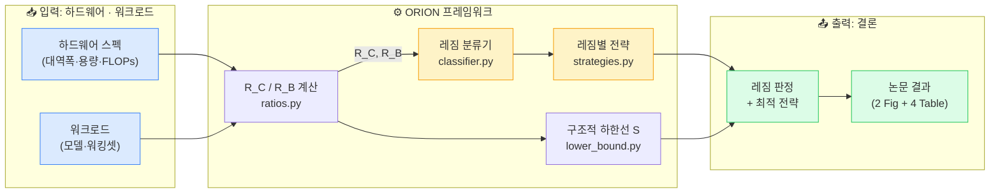
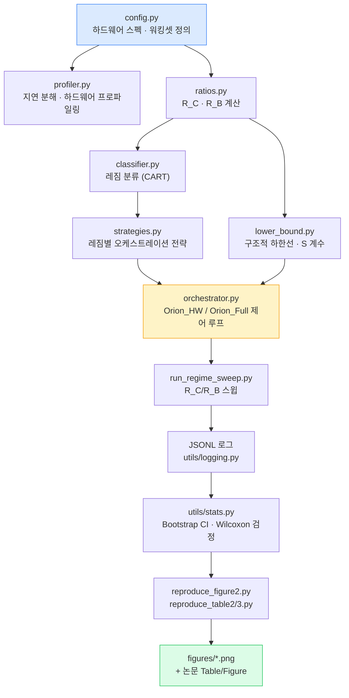
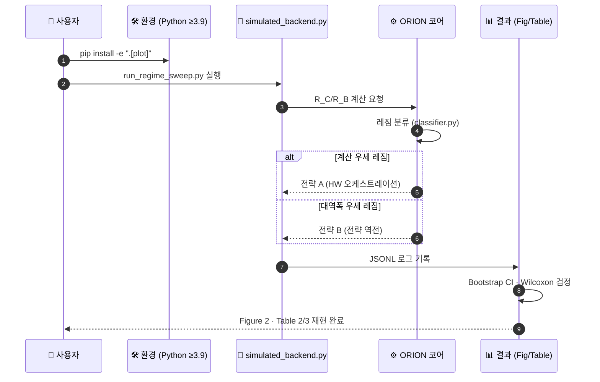

# ORION — 대규모 AI 추론에서 계층적 메모리 오케스트레이션의 레짐 의존적 한계

LaTeX 논문 원고. **1차 투고 대상: Nature Machine Intelligence (확정)** — 폴백: Nature Computational Science → Nature Communications → npj. 투고 전략은 §8·§9 참조.

---

## 한눈에 보기

> **ORION** 은 대규모 AI 추론에서 계층적 메모리 오케스트레이션이 **하드웨어·워크로드 레짐(regime)에 따라 근본적으로 다른 한계**를 갖는다는 것을 규명한 연구입니다. 두 개의 무차원 비율 **R_C**(계산-메모리 비)와 **R_B**(대역폭-용량 비)만으로 시스템의 최적 오케스트레이션 전략이 결정되며, 특정 레짐에서는 전략이 **역전(inversion)** 됩니다.



| 구성 요소 | 역할 | 한 줄 설명 | 위치 |
|-----------|------|-----------|------|
| **R_C / R_B 계산기** | 무차원 비율 도출 | 하드웨어·워크로드에서 두 지표를 산출 | `src/orion/ratios.py` |
| **레짐 분류기** | 레짐 판정 | Depth-3 CART로 <0.1 ms 내 분류 | `src/orion/classifier.py` |
| **레짐별 전략** | 오케스트레이션 결정 | 레짐마다 다른(역전되는) 최적 전략 | `src/orion/strategies.py` |
| **구조적 하한선** | 이론적 한계 | 달성 불가능 영역과 sharpness 계수 S | `src/orion/lower_bound.py` |
| **오케스트레이터** | 통합 제어 루프 | Orion_HW / Orion_Full 실행 | `src/orion/orchestrator.py` |
| **논문 원고** | 결과 정리 | NMI 투고용 `main.tex` (Nature 템플릿) | `section/*.tex` |

**이 저장소로 할 수 있는 일**

| 하고 싶은 것 | 시작 지점 |
|--------------|-----------|
| 논문 PDF 빌드 | [`./run.sh`](#4-빌드-방법) |
| 실험 결과 재현 (GPU 불필요) | [`src/experiments/*.py`](#데이터--동작-흐름도) |
| 레짐 분류 로직 이해 | `src/orion/ratios.py`, `classifier.py` |
| 투고 전략 확인 | [§9 단계별 투고 전략](#9-단계별-투고-전략) |

---

## 데이터 · 동작 흐름도

### 데이터 흐름 (Data Flow)

하드웨어·워크로드 정의에서 출발하여 무차원 비율 → 레짐 판정 → 전략 결정 → 로그/그림/표에 이르는 재현 파이프라인입니다.



### 동작 흐름 (Operation Flow) — 재현 절차



**단계 요약**

| 단계 | 명령 / 스크립트 | 산출물 |
|------|-----------------|--------|
| 1. 환경 준비 | `cd src && pip install -e ".[plot]"` | 실행 환경 |
| 2. 레짐 스윕 | `python experiments/run_regime_sweep.py` | JSONL 로그 |
| 3. 그림 재현 | `python experiments/reproduce_figure2.py` | `figures/*.png` |
| 4. 표 재현 | `python experiments/reproduce_table2.py` 등 | 논문 Table |
| 5. 논문 빌드 | `./run.sh` | `main.pdf` |

> **GPU 없이도** `simulated_backend.py` 로 모든 결과를 재현할 수 있습니다. 라이브 GPU 실험은 `pip install -e ".[gpu,plot]"` 후 동일 스크립트로 수행합니다.

---

## 목차

1. [저장소 구조](#1-저장소-구조)
2. [NCS 투고 준비 현황 체크리스트](#2-ncs-투고-준비-현황-체크리스트)
3. [의존 패키지 설치 (Ubuntu 24.04)](#3-의존-패키지-설치-ubuntu-2404)
4. [빌드 방법](#4-빌드-방법)
5. [PDF 열람](#5-pdf-열람)
6. [익명 처리 스위치](#6-익명-처리-스위치)
7. [Nature 저널 구조 이해](#7-nature-저널-구조-이해)
8. [저널 추천 우선순위](#8-저널-추천-우선순위)
9. [단계별 투고 전략](#9-단계별-투고-전략)
10. [리뷰 절차 및 게재료](#10-리뷰-절차-및-게재료)
11. [투고 대상 자매지 상세 정보](#11-투고-대상-자매지-상세-정보)

---

## 1. 저장소 구조

```
.
├── main.tex                    # 단일 시작파일 — Springer Nature sn-jnl 템플릿 (NMI 투고용) ★
│                               #   NMI 재프레이밍 토글 \ifNMIframing 내장 (기본 ON)
├── sn-jnl.cls                  # Springer Nature 공식 저널 클래스
├── reference-data.bib          # 참고문헌 데이터베이스 (47개 항목)
├── latexmkrc                   # latexmk 설정 (타임존)
├── run.sh                      # 빌드 스크립트 (./run.sh → main.pdf)
├── submission/                 # 투고 지원 문서
│   └── nmi_presubmission_inquiry.md  # NMI presubmission inquiry (커버레터+요약)
├── figures/                    # 그림 파일
│   ├── orion_regime_map.png    # Figure 1 — Regime map (2059×1607 px)
│   ├── orion_consolidated.png  # Figure 2 — Experimental probes (3568×2657 px)
│   └── *.png                   # 기타 보조 그림
├── ppt/                        # 발표 자료
│   ├── orion_en.pptx           # 영문 12슬라이드
│   └── orion_ko.pptx           # 한국어 11슬라이드 (맑은 고딕)
├── src/                        # 실험 재현 코드
│   ├── README.md               # 설치·실행·재현 가이드
│   ├── requirements.txt
│   ├── setup.py
│   ├── orion/                  # 핵심 라이브러리
│   │   ├── config.py           # 하드웨어 스펙·워킹셋 정의
│   │   ├── profiler.py         # HardwareProfiler
│   │   └── ratios.py           # R_C / R_B 계산 및 레짐 분류기
│   ├── utils/
│   │   ├── stats.py            # bootstrap CI, Wilcoxon 검정
│   │   └── logging.py          # JSONL 기록
│   └── experiments/
│       ├── simulated_backend.py
│       ├── run_regime_sweep.py
│       ├── reproduce_figure2.py
│       ├── generate_figure1.py # Figure 1 재생성 스크립트 (300 DPI)
│       ├── reproduce_table2.py
│       ├── reproduce_table3.py
│       └── reproduce_classifier_ablation.py
└── section/                    # 섹션별 .tex 파일  (★ = 현재 단일 빌드에서 사용)
    ├── 001_title.tex           # ★
    ├── 005_author_nature.tex   # sn-jnl 저자 블록 ★
    ├── 006_abstract_nature.tex # 원본 Abstract (NMI 토글 OFF 시 사용)
    ├── 006_abstract_nmi.tex    # NMI 재프레이밍 Abstract (토글 ON, 기본) ★
    ├── 010_introduction.tex    # 원본 Introduction (토글 OFF 시 사용)
    ├── 010_introduction_nmi.tex # NMI 재프레이밍 Introduction (토글 ON, 기본) ★
    ├── 025_results_ncs.tex     # Results (2 Figs + 4 Tables) ★
    ├── 060_discussion.tex      # Discussion ★
    ├── 070_methods.tex         # Methods (starred, URL 익명화) ★
    ├── 090_ack.tex             # ★
    ├── 095_reference_nature.tex # ★
    ├── 900_appendix.tex        # Supplementary Information ★
    │
    └─ [보존 · 현재 빌드 미포함 상세 원고 소스]
       008_materials · 020_regime_principle · 030_transfer_model
       040_experimental_validation · 050_implications · 080_conclusion
```

> ★ 표시는 단일 시작파일 `main.tex` (NMI 투고용 Nature 템플릿)에서 실제로 사용하는 파일입니다.

---

## 2. NCS 투고 준비 현황 체크리스트

> **최종 업데이트: 2026-06-30** (commit `463258a`)

| # | 항목 | 상태 | 비고 |
|---|------|------|------|
| 1 | Abstract ≤150 words | ✅ | 149 words |
| 2 | Main text ≤3,500 words | ⚠️ | 제출 시 Word 변환 후 정확히 확인 필요 |
| 3 | Display items ≤6 (Fig+Table) | ✅ | Fig 2 + Table 4 = 6 |
| 4 | "Here we show…" 선언형 도입부 | ✅ | |
| 5 | NCS Introduction (R_C/R_B 표기, 4개 기여) | ✅ | `010_introduction.tex` 재작성 완료 |
| 6 | Author Contributions | ✅ | `main.tex` 에 추가 |
| 7 | Competing Interests | ✅ | `main.tex` 에 추가 |
| 8 | GitHub URL 익명화 | ✅ | `[anonymised-for-review]` |
| 9 | Acknowledgements 표현 수정 | ✅ | "anonymous reviewers / shepherd" 제거 |
| 10 | Figure 1 고해상도 교체 | ✅ | `orion_regime_map.png` (2059×1607 px) |
| 11 | Figure 2 고해상도 교체 | ✅ | `orion_consolidated.png` (3568×2657 px) |
| 12 | **익명화 플래그 설정** | 🔴 | `main.tex` 상단 `\anonymous` 를 `0` 으로 변경 |
| 13 | **Zenodo DOI 기재** | 🔴 | `070_methods.tex` → `XXXXXXX` 를 실제 DOI로 교체 |
| 14 | arXiv preprint 선공개 | ⬜ | 선택 사항 (권장) |
| 15 | 영문 교정 서비스 | ⬜ | Springer Nature Author Services 또는 Editage |

> 🔴 = 제출 전 반드시 완료 | ⚠️ = 확인 필요 | ✅ = 완료 | ⬜ = 선택

---

## 3. 의존 패키지 설치 (Ubuntu 24.04)

```bash
# TeX Live 핵심 패키지 설치
sudo apt-get update
sudo apt-get install -y \
    texlive-base \
    texlive-latex-base \
    texlive-latex-recommended \
    texlive-latex-extra \
    texlive-fonts-recommended \
    texlive-fonts-extra \
    texlive-science \
    texlive-pictures \
    texlive-bibtex-extra \
    bibtex

# PDF 뷰어 설치
sudo apt-get install -y evince
```

> **참고:** `texlive-science` 패키지에 이 논문에서 필요한 `algorithm.sty` 및 `algorithmicx.sty`가 포함되어 있습니다.

---

## 4. 빌드 방법

단일 시작파일 `main.tex` (Springer Nature 템플릿)를 빌드합니다.

```bash
./run.sh
```

`main.pdf` 파일이 생성됩니다. (이것이 NMI 투고본입니다.)

### `run.sh` 내부 동작 순서

```
pdflatex  →  bibtex  →  pdflatex  →  pdflatex
```

### NMI 재프레이밍 토글 (1차 투고 대상 = Nature Machine Intelligence)

`main.tex` 프리앰블에 `\newif\ifNMIframing` 스위치가 있으며 **기본값은 켜짐(`\NMIframingtrue`)** 입니다.
켜져 있으면 NMI용 재프레이밍 초록·서론이 자동으로 include 됩니다.

| 스위치 | 초록 | 서론 |
|--------|------|------|
| `\NMIframingtrue` (기본) | `006_abstract_nmi.tex` (NMI 서사) | `010_introduction_nmi.tex` (NMI 서사) |
| `\NMIframingfalse` | `006_abstract_nature.tex` (원본) | `010_introduction.tex` (원본) |

원본 NCS 서사로 되돌리려면 `main.tex`의 `\NMIframingtrue` → `\NMIframingfalse` 로만 바꾸면 됩니다.

---

## 5. PDF 열람

```bash
evince main.pdf              # GNOME 기본 뷰어
```

기타 뷰어:

```bash
xdg-open main.pdf            # 시스템 기본 뷰어
okular main.pdf              # KDE 뷰어
zathura main.pdf             # 경량 뷰어
```

---

## 6. 익명 처리 스위치

`main.tex` 상단의 `\anonymous` 값으로 저자 공개 여부를 제어합니다.

| 값 | 효과 |
|----|------|
| `1` | 실제 저자명 및 소속 표시 |
| `0` | 블라인드 리뷰용 익명 처리 |

---

## 7. Nature 저널 구조 이해

**Nature (본지)** 는 1869년 창간된 단일 저널이고, 그 아래 특화 자매지들이 별도 저널로 운영됩니다. 구조는 다음과 같습니다.

```
Springer Nature (출판사)
│
├── Nature  ←── 본지 (주1회 발행, 모든 과학 분야 최상위)
│
├── Nature Research Journals (자매지 — 분야별)
│   ├── Nature Medicine
│   ├── Nature Machine Intelligence     ← 이 논문 3순위
│   ├── Nature Computational Science   ← 이 논문 1순위
│   ├── Nature Electronics
│   ├── Nature Communications          ← 이 논문 2순위
│   ├── Nature Biotechnology
│   ├── Nature Physics  ... 등 50여개
│
└── npj (Nature Partner Journals) — 외부 기관과 공동 발행
    ├── npj Computational Intelligence ← 이 논문 4순위
    └── npj Digital Medicine ... 등
```

**핵심 차이점:**

- **Nature 본지** 투고 = 노벨상급 발견 수준 요구. CS 논문은 사실상 불가에 가까움
- **자매지** 투고 = 각 저널의 편집팀이 독립적으로 운영. 본지와 별도 심사
- 같은 "Nature" 브랜드지만 **편집위원회, 심사 기준, APC가 모두 다름**
- 자매지 탈락 후 다른 자매지로 **원고 이전(manuscript transfer) 서비스** 제공
- 구독 방식(Subscription)으로 제출 시 **게재료 무료**
- Open Access 선택 시 약 $11,690 USD (2024 기준)
- 삼성전자의 Springer Nature 기관 협약 여부는 사내 도서관 확인 권장

---

## 8. 저널 추천 우선순위

> **✅ 최종 결정 (2026-07): 1차 투고 대상 = Nature Machine Intelligence (NMI)**
>
> 본 연구팀은 NMI를 1차 투고 대상으로 **확정**했습니다. 근거:
> 1. **회사 차원의 NMI 투고 장려**
> 2. **최상위 위상** — 2026년 6월 공개 최신 IF 약 29.8 (JCR Q1)
> 3. **AI 도메인 연구** — 본 연구는 대규모 AI 추론의 근본적·레짐 의존적 한계를 다룸
>
> **성공의 관건은 재프레이밍입니다.** 원고를 "메모리 시스템 엔지니어링 최적화"가 아니라
> **"기계지능(machine intelligence)의 일반 원리 발견"** 으로 다시 잡아야 desk-rejection을 피합니다.
> NMI용 재프레이밍 초안은 [`section/006_abstract_nmi.tex`](section/006_abstract_nmi.tex),
> [`section/010_introduction_nmi.tex`](section/010_introduction_nmi.tex)에 있습니다.
>
> 정식 투고 전 **presubmission inquiry**로 스코프 적합성을 먼저 검증합니다
> (문의서: [`submission/nmi_presubmission_inquiry.md`](submission/nmi_presubmission_inquiry.md)).
> 실행 순서는 **§9**를 참조하세요.
>
> 아래 ★ 순위는 **저널 스코프 적합도 분석**으로, NMI 리젝 시 **폴백 순서
> (NCS → Nature Communications → npj)** 의 근거로 유지합니다.

### 1순위: Nature Computational Science ★★★★★

```
선택 이유:
- "대규모 시뮬레이션·HPC·데이터 기반 과학 연구" → Nature Computational Science
  (선택 가이드 직접 해당)
- 계산 과학 + 수학적 모델링 + 실험 검증 구조가 저널 성격과 정확히 일치
- Phase transition 발견이라는 다학제적 언어가 이 저널 심사위원에게 친숙
- Nature Machine Intelligence 대비, AI 분야가 여전히 학회·arXiv 중심 문화를 유지하는 점에서 계산과학 독자층 접근에 유리
- 삼성전자 SAIT의 Nature Communications 선례(유현승, 함돈회)가 심사 신뢰도에 긍정적
```

### 2순위: Nature Communications ★★★★

```
선택 이유:
- 오픈 액세스 → 피인용 접근성 극대화 (H-Index 300+ 저널)
- 삼성전자 직원 1저자 게재 선례 명확히 존재
  · 유현승(SAIT) → Nature Communications, 2023
  · 안중권(SAIT) → Nature Communications, 2020
- 심사 난이도가 상대적으로 낮아 게재 가능성 현실적
- 다분야 융합 논문에 유리 (AI + 시스템 + 물리 유사 현상)
- 탈락 시 Nature Computational Science → Nature Communications 순으로
  동일 원고를 빠르게 재투고 가능
```

### 3순위: Nature Machine Intelligence ★★★★

```
선택 이유:
- AI·ML 분야 최상위 저널 (2026년 6월 공개 최신 IF 약 29.8, JCR Q1)
  → 본 연구의 LLM 추론 붕괴·phase transition 주제와 스코프 직접 일치
- "AI 보이콧으로 배척받는 저널"이라는 과거 진단은 현재 시점에서 과장·outdated
  (아래 정보 갱신 참조) — 위상 자체는 확고한 최상위권
- 1순위(NCS)보다 낮춘 이유:
  · 본 원고의 계산과학·수리 모델링 프레이밍은 NCS 스코프에 더 적합
  · desk-rejection 위험이 높은 편
  · AI 커뮤니티가 여전히 학회(NeurIPS·ICML·ICLR)·arXiv를 최우선 발표
    채널로 선호하는 문화가 남아 저널 채널 피인용 확산은 상대적으로 제한적
- 2순위(Nature Communications)보다 낮춘 이유:
  · 완전 OA에 따른 피인용 접근성, 삼성전자 1저자 게재 선례,
    상대적으로 현실적인 게재율 측면에서 Nature Communications가 우위
```

> **정보 갱신 (2026 기준):** 과거 "AI 학계 전체가 보이콧하여 배척받는 저널"이라는 서술은 **오래된(outdated) 정보**입니다. 실제로는 다음과 같습니다.
>
> - **2018년 보이콧은 종료됨.** 2018년 5월경 약 3,000명의 컴퓨터과학자가 폐쇄형(구독료 기반) 모델에 반대하며 창간 전(2019년 1월 창간) 청원에 서명한 사건이었으나, 이후 저널은 정착·성장함.
> - **현재 위상은 최상위권.** 2025년 약 195편 발행, 2026년 6월 공개된 최신 Impact Factor **약 29.8 (JCR Q1)**. "Stop explaining black box machine learning models…"(1,200회 이상 피인용) 등 고피인용 논문을 다수 배출하며 학술적으로 확고히 자리 잡음.
> - **남은 뉘앙스.** 활발한 보이콧 캠페인은 없으나, AI 커뮤니티가 여전히 학회(NeurIPS·ICML·ICLR)와 오픈액세스(arXiv)를 최우선 발표 채널로 선호하는 문화는 지속됨. 즉 "AI 연구자의 1순위 채널은 아니다" 정도는 유효하지만, "배척받는 저널"이라는 진단은 현재 시점에서 과장임.

### 4순위: npj Computational Intelligence ★★★

```
선택 이유:
- 비교적 새로운 저널로 AI·CS 모두 수용
- 1·2·3순위 탈락 시 안전망
- Impact Factor 축적 중 → 지금 게재 시 선도 논문으로 인용 효과 기대
```

---

## 9. 단계별 투고 전략

### Step 1 — arXiv 선공개 (즉시 가능)

```
Nature Medicine 사례(arXiv 2024 → Nature Medicine 2025)처럼
preprint를 먼저 공개하여 커뮤니티 반응 수집 및 선점 효과 확보.
투고 시 preprint 사실을 투명하게 고지 (자기표절 아님 — 정상적 관행).
```

### Step 2 — 영어 편집 서비스

```
Nature 투고 전 전문 영어 편집 필수.
- Springer Nature Author Services (공식)
- Editage (editage.co.kr)
```

### Step 3 — NMI용 재프레이밍 + Presubmission Inquiry (핵심)

```
NMI 성공의 관건. 리젝 사이클을 태우지 않고 스코프를 검증하는 안전장치.

3-1. 재프레이밍: 서사 무게중심을 "엔지니어링 성과"에서
     "기계지능의 근본 원리 발견"으로 이동
     - 초록:  section/006_abstract_nmi.tex
     - 서론:  section/010_introduction_nmi.tex
     - 산업 CPS·IEC 61508 안전 내용은 "부가 검증"으로만 배치

3-2. Presubmission inquiry 발송 (커버레터+요약만, 회신 1~2주)
     - 문의서: submission/nmi_presubmission_inquiry.md
     - 에디터 긍정 → NMI 정식 투고
     - 에디터 부정 → NCS를 1차 타깃으로 전환
```

### Step 4 — 투고 순서 (NMI 우선)

```
[사전] arXiv 프리프린트 + NMI presubmission inquiry (Step 1·3)
        │
[1차] Nature Machine Intelligence   ← 회사 방침 + 최상위 위상, 재프레이밍 선행
        ↓ (탈락 시, transfer로 하향 재투고)
[2차] Nature Computational Science   ← 현재 톤에 가장 가까운 폴백
        ↓ (탈락 시)
[3차] Nature Communications          ← OA 접근성 + 삼성 1저자 선례
        ↓ (탈락 시)
[4차] npj Computational Intelligence ← 최후 안전망

주: Nature 포트폴리오 이관(transfer)은 고IF→저IF 하향이 자연스러움.
    따라서 NMI(29.8)를 먼저 도전한 뒤 하향 폴백하는 것이 흐름상 유리.
```

### Step 5 — 논문 프레이밍 강화 포인트

```
"Here we show..." 구조는 Nature 스타일에 이미 맞음.
심사 통과를 위해 강조해야 할 요소:

1. "Phase transition" 유사성을 명시
   → 레짐 전이가 불연속(abrupt)임을 기계지능의 원리로 제시

2. "General principle of memory-bound machine intelligence" 확장성 강조
   → 특정 오케스트레이터가 아니라 대규모 AI 추론 전반의 법칙으로 프레이밍

3. 다중 플랫폼·다중 워크로드 일반성 인용
   → 특정 하드웨어 종속이 아닌 보편 원리임을 입증 (NMI 설득 핵심)
```

---

## 10. 리뷰 절차 및 게재료

### 리뷰 절차 (통상 4~6개월)

| 단계 | 소요 기간 | 내용 |
|------|-----------|------|
| Desk review (편집장 사전 검토) | 1~2주 | Scope 부적합 시 즉시 반려 |
| Peer review (외부 심사) | 8~14주 | 2~3명 전문가 심사 |
| 1차 결정 | — | Accept / Major revision / Minor revision / Reject |
| 수정 및 재심사 | 4~8주 | 통상 1~2 라운드 |
| 최종 승인 | 1~2주 | 게재 확정 |
| **총 소요** | **4~6개월** | 빠르면 3개월 |

### 게재료 (APC)

| 출판 방식 | 게재료 |
|-----------|--------|
| 구독 방식 (Subscription) | **무료** (저자 부담 없음) |
| Open Access | 약 $11,690 USD (2024 기준) |

> **결론:** 구독 방식으로 제출하면 **게재료 무료**입니다.
> 단, 독자는 구독 없이 열람 불가.
> 삼성전자는 Springer Nature와 기관 협약(Read & Publish)을 맺고 있을 가능성이 높으므로 소속 도서관에 확인 권장.

---

## 11. 투고 대상 자매지 상세 정보

### 11-1. Nature Computational Science (1순위)

| 항목 | 내용 |
|------|------|
| **창간** | 2021년 1월 |
| **Impact Factor (2024)** | **18.3** (5년 평균 17.6) |
| **CiteScore (2024)** | 21.2 (Q1) |
| **IF 성장률** | 2023 대비 약 +29% 급성장 중 |
| **Desk rejection rate** | 약 75~80% (scope 부적합 시 즉시 반려) |
| **Peer review 통과율** | 심사 진입 후 약 25~30% |
| **실질 accept rate** | 전체 제출 기준 약 **5~8%** |
| **주요 분야** | 계산 과학, HPC, 데이터 과학, 시뮬레이션, AI 응용 |
| **출판 형태** | 하이브리드 (구독 + OA 선택 가능) |

#### 게재료 (APC) 및 원고 규정

| 항목 | 내용 |
|------|------|
| **구독 방식 (Subscription)** | **무료** — 페이지 수 무관, 저자 부담 없음 |
| **Open Access APC** | £9,390 / **$12,850** / €10,850 (2024 기준) |
| **페이지 과금** | **없음** — Nature 계열 전체가 페이지당 과금 불가 |
| **본문 단어 수 제한** | **3,500 단어** (Abstract·Methods·참고문헌·그림설명 제외) |
| **Abstract 제한** | 150 단어 (인용 없이) |
| **Display items (그림+표)** | **최대 6개** |

> **페이지 수와 무관하게 구독 방식은 완전 무료입니다.**
> Nature 저널은 전통적인 "페이지 과금(page charge)" 제도가 없습니다.
> OA를 선택하는 경우에만 위 APC를 일괄 납부합니다.

> **주의:** 본문 3,500 단어 제한이 엄격합니다. 현재 원고는 이 제한에 맞게
> 재편집이 필요합니다. Methods와 상세 실험은 Supplementary Material로 이동하고
> 본문에는 핵심 주장과 주요 결과만 남겨야 합니다.

---

### 11-2. Nature Communications (2순위)

| 항목 | 내용 |
|------|------|
| **창간** | 2010년 |
| **Impact Factor (2024)** | 약 **14.7** |
| **H-Index** | 300 이상 (Google Scholar 기준 최근 5년) |
| **Desk rejection rate** | 약 60~70% |
| **Peer review 통과율** | 심사 진입 후 약 30~40% |
| **실질 accept rate** | 전체 제출 기준 약 **15~20%** |
| **주요 분야** | 모든 자연과학 분야 (오픈 액세스 전용) |
| **출판 형태** | **완전 OA 전용** (구독 방식 없음) |

#### 게재료 (APC) 및 원고 규정

| 항목 | 내용 |
|------|------|
| **구독 방식 (Subscription)** | **없음** — 100% Open Access 저널 |
| **Open Access APC** | £5,490 / **$7,350** / €6,150 (2024 기준) |
| **페이지 과금** | **없음** |
| **본문 단어 수 제한** | **5,000 단어** (Abstract·Methods·참고문헌 제외) |
| **Abstract 제한** | 200 단어 (인용 없이) |
| **Display items (그림+표)** | **최대 10개** (2,000단어 미만 시 4개) |

> **Nature Communications는 완전 OA 전용이므로 반드시 APC($7,350)를 납부해야 합니다.**
> 단, 삼성전자가 Springer Nature와 기관 협약을 체결한 경우 APC 감면 또는 면제가 가능합니다.
> 반드시 사내 도서관/연구지원팀에 확인하세요.

---

### 11-3. Nature Machine Intelligence (3순위)

| 항목 | 내용 |
|------|------|
| **창간** | 2019년 1월 |
| **Impact Factor (2026년 6월 최신)** | **약 29.8** (JCR Q1) |
| **2025년 발행 편수** | 약 195편 |
| **Desk rejection rate** | 높음 (Nature 계열 최상위 수준 — scope 부적합 시 즉시 반려) |
| **실질 accept rate** | 낮음 (전체 제출 기준 한 자릿수 추정) |
| **주요 분야** | 머신러닝, AI 이론·방법론, 지능형 시스템, AI 응용 |
| **출판 형태** | 하이브리드 (구독 + OA 선택 가능) |

#### 게재료 (APC) 및 원고 규정

| 항목 | 내용 |
|------|------|
| **구독 방식 (Subscription)** | **무료** — 페이지 수 무관, 저자 부담 없음 |
| **Open Access APC** | Nature 계열 상위 수준 (약 $12,000대, 투고 시점 공식 지침 확인 필요) |
| **페이지 과금** | **없음** |
| **본문 단어 수 제한** | Article 기준 약 5,000단어 수준 (투고 지침 직접 확인 권장) |
| **Abstract 제한** | 약 150~200단어 (인용 없이) |

> **위상 자체는 최상위권**이며 과거의 "보이콧으로 배척받는 저널" 진단은
> 현재 시점(2026)에서 과장입니다 (섹션 8의 정보 갱신 참조).
> 다만 본 원고의 계산과학·수리 모델링 프레이밍상 스코프 적합도는
> Nature Computational Science가 더 높아 3순위로 배치합니다.

---

### 11-4. npj Computational Intelligence (4순위 — 안전망)

| 항목 | 내용 |
|------|------|
| **창간** | 2024년 (신설) |
| **Impact Factor** | 미집계 (신설 저널) |
| **Desk rejection rate** | 낮음 (신설 저널 특성상 적극 수용) |
| **실질 accept rate** | 상대적으로 높음 (30~40% 추정) |
| **주요 분야** | 범용 AI, ML 이론, 응용 AI, CS |
| **출판 형태** | OA (npj 계열) |

#### 게재료 (APC) 및 원고 규정

| 항목 | 내용 |
|------|------|
| **Open Access APC** | npj 계열 표준 약 $3,590 수준 (확인 필요) |
| **페이지 과금** | **없음** |
| **본문 단어 수 제한** | 미정 (신설 저널 — 투고 지침 직접 확인 권장) |

> **신설 저널**로 IF가 없지만 Nature 브랜드 효과는 존재합니다.
> 1·2·3순위 탈락 시 최후 안전망으로 활용하세요.

---

### 11-5. 4개 저널 한눈에 비교

| 항목 | Nature Computational Science | Nature Communications | Nature Machine Intelligence | npj Comp. Intelligence |
|------|------------------------------|----------------------|-----------------------------|------------------------|
| **우선순위** | 1순위 | 2순위 | 3순위 | 4순위 |
| **IF** | **18.3** (2024) | 14.7 (2024) | **약 29.8** (2026 최신) | 미집계 |
| **Accept rate** | 5~8% | 15~20% | 한 자릿수 (추정) | 30~40% (추정) |
| **구독방식 게재료** | **무료** | 없음 (OA전용) | **무료** | — |
| **OA APC** | $12,850 | $7,350 | ~$12,000대 (확인 필요) | ~$3,590 |
| **본문 단어 제한** | **3,500** | 5,000 | ~5,000 (확인 필요) | 미정 |
| **그림+표 최대** | **6개** | 10개 | 미정 | 미정 |
| **Abstract 제한** | 150단어 | 200단어 | 150~200단어 | 미정 |
| **페이지 과금** | 없음 | 없음 | 없음 | 없음 |
| **투고 난이도** | ★★★★★ | ★★★☆☆ | ★★★★★ | ★★☆☆☆ |

> **핵심 결론:**
> - Nature Computational Science는 **구독 방식으로 제출 시 완전 무료**, 페이지 제한 없음
> - 단, **본문 3,500 단어 제한**이 가장 큰 준비 과제 (현재 원고 대폭 압축 필요)
> - Nature Communications는 반드시 APC 납부 필요 ($7,350)
> - 모든 Nature 계열 저널은 **페이지당 과금(page charge) 제도 없음**
