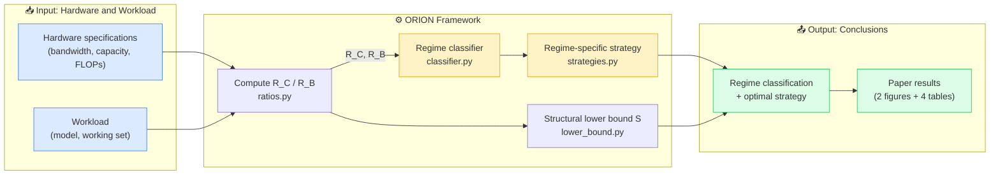
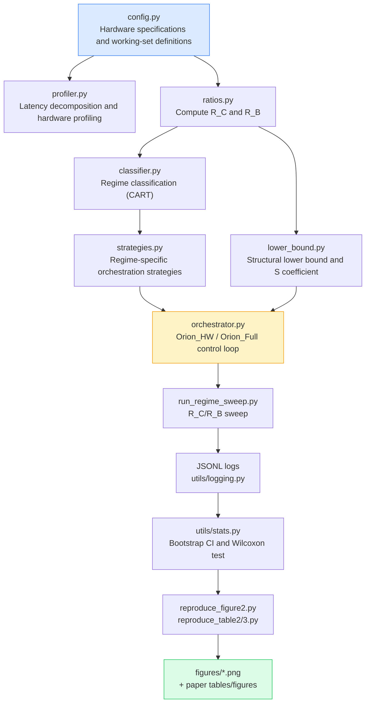
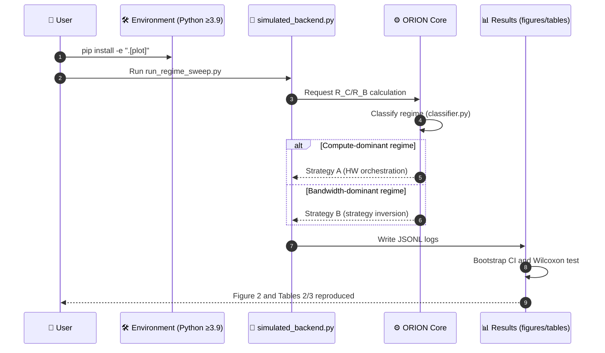

# ORION — Regime-Dependent Limits of Hierarchical Memory Orchestration in Large-Scale AI Inference

LaTeX manuscript. **Primary submission target: Nature Machine Intelligence (confirmed)** — fallback: Nature Computational Science → Nature Communications → npj. See §§8–9 for the submission strategy.

---

## Overview

> **ORION** demonstrates that hierarchical memory orchestration in large-scale AI inference has **fundamentally different limits across hardware and workload regimes**. The optimal orchestration strategy is determined by only two dimensionless ratios: **R_C** (compute-to-memory ratio) and **R_B** (bandwidth-to-capacity ratio). In certain regimes, the optimal strategy **inverts**.



| Component | Role | Summary | Location |
|-----------|------|---------|----------|
| **R_C / R_B calculator** | Derive dimensionless ratios | Computes both metrics from the hardware and workload | `src/orion/ratios.py` |
| **Regime classifier** | Classify regimes | Classifies in <0.1 ms using a depth-3 CART | `src/orion/classifier.py` |
| **Regime-specific strategies** | Select orchestration | Applies the optimal strategy, which may invert across regimes | `src/orion/strategies.py` |
| **Structural lower bound** | Establish theoretical limits | Identifies unattainable regions and the sharpness coefficient S | `src/orion/lower_bound.py` |
| **Orchestrator** | Integrated control loop | Runs Orion_HW / Orion_Full | `src/orion/orchestrator.py` |
| **Manuscript** | Present results | `main.tex` for NMI submission (Nature template) | `section/*.tex` |

**What you can do with this repository**

| Goal | Starting point |
|------|----------------|
| Build the paper PDF | [`./run.sh`](#4-building-the-paper) |
| Reproduce experimental results (no GPU required) | [`src/experiments/*.py`](#data-and-operation-flow) |
| Understand the regime-classification logic | `src/orion/ratios.py`, `classifier.py` |
| Review the submission strategy | [§9 Step-by-Step Submission Strategy](#9-step-by-step-submission-strategy) |

---

## Data and Operation Flow

### Data Flow

The reproduction pipeline proceeds from hardware and workload definitions through dimensionless ratios, regime classification, strategy selection, and finally logs, figures, and tables.



### Operation Flow — Reproduction Procedure



**Step summary**

| Step | Command / script | Output |
|------|------------------|--------|
| 1. Prepare the environment | `cd src && pip install -e ".[plot]"` | Runtime environment |
| 2. Sweep regimes | `python experiments/run_regime_sweep.py` | JSONL logs |
| 3. Reproduce figures | `python experiments/reproduce_figure2.py` | `figures/*.png` |
| 4. Reproduce tables | `python experiments/reproduce_table2.py`, etc. | Paper tables |
| 5. Build the paper | `./run.sh` | `main.pdf` |

> You can reproduce all results **without a GPU** using `simulated_backend.py`. For live GPU experiments, run `pip install -e ".[gpu,plot]"` and use the same scripts.

---

## Table of Contents

1. [Repository Structure](#1-repository-structure)
2. [NCS Submission Readiness Checklist](#2-ncs-submission-readiness-checklist)
3. [Installing Dependencies (Ubuntu 24.04)](#3-installing-dependencies-ubuntu-2404)
4. [Building the Paper](#4-building-the-paper)
5. [Viewing the PDF](#5-viewing-the-pdf)
6. [Anonymization Switch](#6-anonymization-switch)
7. [Understanding the Nature Journal Portfolio](#7-understanding-the-nature-journal-portfolio)
8. [Recommended Journal Priorities](#8-recommended-journal-priorities)
9. [Step-by-Step Submission Strategy](#9-step-by-step-submission-strategy)
10. [Review Process and Publication Fees](#10-review-process-and-publication-fees)
11. [Detailed Information on Target Sister Journals](#11-detailed-information-on-target-sister-journals)

---

## 1. Repository Structure

```
.
├── main.tex                    # Single entry file — Springer Nature sn-jnl template (NMI submission) ★
│                               #   Includes the \ifNMIframing toggle (ON by default)
├── sn-jnl.cls                  # Official Springer Nature journal class
├── reference-data.bib          # Bibliography database (47 entries)
├── latexmkrc                   # latexmk configuration (timezone)
├── run.sh                      # Build script (./run.sh → main.pdf)
├── submission/                 # Submission support documents
│   └── nmi_presubmission_inquiry.md  # NMI presubmission inquiry (cover letter + summary)
├── figures/                    # Figure files
│   ├── orion_regime_map.png    # Figure 1 — Regime map (2059×1607 px)
│   ├── orion_consolidated.png  # Figure 2 — Experimental probes (3568×2657 px)
│   └── *.png                   # Other supplementary figures
├── ppt/                        # Presentation materials
│   ├── orion_en.pptx           # 12 English slides
│   └── orion_ko.pptx           # 11 Korean slides (Malgun Gothic)
├── src/                        # Experiment reproduction code
│   ├── README.md               # Installation, execution, and reproduction guide
│   ├── requirements.txt
│   ├── setup.py
│   ├── orion/                  # Core library
│   │   ├── config.py           # Hardware specifications and working-set definitions
│   │   ├── profiler.py         # HardwareProfiler
│   │   └── ratios.py           # R_C / R_B calculation and regime classifier
│   ├── utils/
│   │   ├── stats.py            # Bootstrap CI and Wilcoxon test
│   │   └── logging.py          # JSONL logging
│   └── experiments/
│       ├── simulated_backend.py
│       ├── run_regime_sweep.py
│       ├── reproduce_figure2.py
│       ├── generate_figure1.py # Figure 1 regeneration script (300 DPI)
│       ├── reproduce_table2.py
│       ├── reproduce_table3.py
│       └── reproduce_classifier_ablation.py
└── section/                    # Per-section .tex files (★ = used by the current single build)
    ├── 001_title.tex           # ★
    ├── 005_author_nature.tex   # sn-jnl author block ★
    ├── 006_abstract_nature.tex # Original abstract (used when NMI toggle is OFF)
    ├── 006_abstract_nmi.tex    # NMI-reframed abstract (toggle ON by default) ★
    ├── 010_introduction.tex    # Original introduction (used when NMI toggle is OFF)
    ├── 010_introduction_nmi.tex # NMI-reframed introduction (toggle ON by default) ★
    ├── 025_results_ncs.tex     # Results (2 Figs + 4 Tables) ★
    ├── 060_discussion.tex      # Discussion ★
    ├── 070_methods.tex         # Methods (starred, URLs anonymized) ★
    ├── 090_ack.tex             # ★
    ├── 095_reference_nature.tex # ★
    ├── 900_appendix.tex        # Supplementary Information ★
    │
    └─ [Preserved detailed manuscript sources not included in the current build]
       008_materials · 020_regime_principle · 030_transfer_model
       040_experimental_validation · 050_implications · 080_conclusion
```

> ★ marks files actually used by the single entry file `main.tex` (Nature template for NMI submission).

---

## 2. NCS Submission Readiness Checklist

> **Last updated: 2026-06-30** (commit `463258a`)

| # | Item | Status | Notes |
|---|------|--------|-------|
| 1 | Abstract ≤150 words | ✅ | 149 words |
| 2 | Main text ≤3,500 words | ⚠️ | Verify precisely after converting to Word for submission |
| 3 | Display items ≤6 (Fig+Table) | ✅ | Fig 2 + Table 4 = 6 |
| 4 | Declarative "Here we show…" opening | ✅ | |
| 5 | NCS introduction (R_C/R_B notation, four contributions) | ✅ | `010_introduction.tex` rewritten |
| 6 | Author Contributions | ✅ | Added to `main.tex` |
| 7 | Competing Interests | ✅ | Added to `main.tex` |
| 8 | GitHub URL anonymization | ✅ | `[anonymised-for-review]` |
| 9 | Acknowledgements wording revised | ✅ | Removed "anonymous reviewers / shepherd" |
| 10 | Figure 1 replaced with high-resolution version | ✅ | `orion_regime_map.png` (2059×1607 px) |
| 11 | Figure 2 replaced with high-resolution version | ✅ | `orion_consolidated.png` (3568×2657 px) |
| 12 | **Set anonymization flag** | 🔴 | Change `\anonymous` at the top of `main.tex` to `0` |
| 13 | **Provide Zenodo DOI** | 🔴 | Replace `XXXXXXX` in `070_methods.tex` with the actual DOI |
| 14 | Release arXiv preprint first | ⬜ | Optional (recommended) |
| 15 | Professional English editing | ⬜ | Springer Nature Author Services or Editage |

> 🔴 = required before submission | ⚠️ = verification needed | ✅ = complete | ⬜ = optional

---

## 3. Installing Dependencies (Ubuntu 24.04)

```bash
# Install the core TeX Live packages
sudo apt-get update
sudo apt-get install -y \
    texlive-base \
    texlive-latex-base \
    texlive-latex-recommended \
    texlive-latex-extra \
    texlive-fonts-recommended \
    texlive-fonts-extra \
    texlive-science \
    texlive-pictures \
    texlive-bibtex-extra \
    bibtex

# Install a PDF viewer
sudo apt-get install -y evince
```

> **Note:** The `texlive-science` package includes `algorithm.sty` and `algorithmicx.sty`, which are required by this paper.

---

## 4. Building the Paper

Build the single entry file `main.tex` (Springer Nature template).

```bash
./run.sh                # Review build: show each paper's URL in the References
./run.sh --submission   # Submission build: remove URLs from the References
```

This generates `main.pdf`. Use the PDF built with `--submission` when submitting the paper.

### Reference URL Toggle (`--submission`)

- The default build retains the `url={...}` fields in `reference-data.bib`, displaying a direct link to each source in the References section.
- The `--submission` build temporarily removes only the `url={...}` fields before running BibTeX and automatically restores `reference-data.bib` when the build finishes.
- `\url{}` entries inside `note` or `howpublished` are retained when the web resource itself is the cited source.

### Internal `run.sh` Sequence

```
pdflatex  →  bibtex  →  pdflatex  →  pdflatex
```

### NMI Reframing Toggle (Primary Target = Nature Machine Intelligence)

The `main.tex` preamble contains a `\newif\ifNMIframing` switch, which is **enabled by default (`\NMIframingtrue`)**. When enabled, the NMI-reframed abstract and introduction are included automatically.

| Switch | Abstract | Introduction |
|--------|----------|--------------|
| `\NMIframingtrue` (default) | `006_abstract_nmi.tex` (NMI narrative) | `010_introduction_nmi.tex` (NMI narrative) |
| `\NMIframingfalse` | `006_abstract_nature.tex` (original) | `010_introduction.tex` (original) |

To restore the original NCS narrative, simply change `\NMIframingtrue` to `\NMIframingfalse` in `main.tex`.

---

## 5. Viewing the PDF

```bash
evince main.pdf              # Default GNOME viewer
```

Other viewers:

```bash
xdg-open main.pdf            # System default viewer
okular main.pdf              # KDE viewer
zathura main.pdf             # Lightweight viewer
```

---

## 6. Anonymization Switch

The `\anonymous` value at the top of `main.tex` controls whether author information is displayed.

| Value | Effect |
|-------|--------|
| `1` | Show actual author names and affiliations |
| `0` | Anonymize for blind review |

---

## 7. Understanding the Nature Journal Portfolio

**Nature (the flagship journal)** was founded in 1869. Specialized sister journals operate independently under the same portfolio:

```
Springer Nature (publisher)
│
├── Nature  ←── Flagship (weekly, top-tier across all sciences)
│
├── Nature Research Journals (field-specific sister journals)
│   ├── Nature Medicine
│   ├── Nature Machine Intelligence     ← Third priority for this paper
│   ├── Nature Computational Science   ← First priority for this paper
│   ├── Nature Electronics
│   ├── Nature Communications          ← Second priority for this paper
│   ├── Nature Biotechnology
│   ├── Nature Physics ... and around 50 others
│
└── npj (Nature Partner Journals) — co-published with external institutions
    ├── npj Computational Intelligence ← Fourth priority for this paper
    └── npj Digital Medicine ... and others
```

**Key differences:**

- A submission to the **Nature flagship** must represent a discovery of exceptional, potentially Nobel-level significance; acceptance of a CS paper is extremely unlikely.
- Each **sister journal** has an independent editorial team and review process.
- Although they share the "Nature" brand, their **editorial boards, review criteria, and APCs differ**.
- A **manuscript transfer service** is available between sister journals after rejection.
- Publication is **free of charge** under the subscription model.
- Open Access costs approximately $11,690 USD (2024 rate).
- Check with your institutional library to determine whether an applicable Springer Nature agreement is available.

---

## 8. Recommended Journal Priorities

> **✅ Final decision (2026-07): Primary submission target = Nature Machine Intelligence (NMI)**
>
> The research team has **confirmed** NMI as the primary submission target for three reasons:
> 1. **Institutional encouragement to submit to NMI**
> 2. **Top-tier standing** — latest IF of approximately 29.8, released in June 2026 (JCR Q1)
> 3. **AI-domain research** — this work examines fundamental, regime-dependent limits in large-scale AI inference
>
> **Reframing is critical to success.** To avoid desk rejection, the manuscript must be positioned not as "memory-system engineering optimization" but as the **"discovery of a general principle of machine intelligence."** Draft NMI reframing is available in [`section/006_abstract_nmi.tex`](section/006_abstract_nmi.tex) and [`section/010_introduction_nmi.tex`](section/010_introduction_nmi.tex).
>
> Before formal submission, use a **presubmission inquiry** to confirm scope fit (inquiry: [`submission/nmi_presubmission_inquiry.md`](submission/nmi_presubmission_inquiry.md)). See **§9** for the sequence.
>
> The ★ ranking below reflects **journal-scope fit** and provides the rationale for the **fallback order (NCS → Nature Communications → npj)** if NMI rejects the manuscript.

### First Priority: Nature Computational Science ★★★★★

```
Reasons:
- "Large-scale simulation, HPC, and data-driven scientific research" maps directly
  to Nature Computational Science according to the journal-selection guide.
- The combination of computational science, mathematical modeling, and
  experimental validation matches the journal precisely.
- Its reviewers are familiar with interdisciplinary language around phase transitions.
- Compared with Nature Machine Intelligence, the computational-science readership
  may offer better reach while AI remains centered on conferences and arXiv.
- Prior Nature Communications publications by researchers at Samsung SAIT
  provide relevant institutional precedent.
```

### Second Priority: Nature Communications ★★★★

```
Reasons:
- Open Access maximizes citation accessibility (journal H-index above 300).
- Clear precedent exists for first-author publications by Samsung Electronics researchers:
  · Hyunseung Yoo (SAIT) → Nature Communications, 2023
  · Jungkwon Ahn (SAIT) → Nature Communications, 2020
- The comparatively lower review barrier makes acceptance more realistic.
- It is well suited to multidisciplinary work (AI + systems + physics-like phenomena).
- After rejection, the same manuscript can be resubmitted quickly from
  Nature Computational Science to Nature Communications.
```

### Third Priority: Nature Machine Intelligence ★★★★

```
Reasons:
- A top-tier AI/ML journal (latest IF approximately 29.8, released June 2026; JCR Q1),
  directly aligned with this study's LLM inference collapse and phase-transition topics.
- The earlier claim that the journal is shunned because of an AI boycott is now
  exaggerated and outdated (see the update below); its top-tier standing is well established.
- Reasons for ranking it below NCS:
  · The manuscript's computational-science and mathematical-modeling framing fits NCS better.
  · Desk-rejection risk is high.
  · The AI community still favors conferences (NeurIPS, ICML, ICLR) and arXiv as
    primary publication channels, relatively limiting citation diffusion through journals.
- Reasons for ranking it below Nature Communications:
  · Nature Communications has stronger citation accessibility through full OA,
    first-author precedent from Samsung Electronics, and a more realistic acceptance rate.
```

> **Information update (as of 2026):** The earlier description of the journal as "shunned because the entire AI community boycotts it" is **outdated**:
>
> - **The 2018 boycott has ended.** Around May 2018, approximately 3,000 computer scientists signed a petition opposing the closed, subscription-based model before the journal launched in January 2019. The journal subsequently became established and grew.
> - **Its current standing is top-tier.** It published approximately 195 papers in 2025, and its latest Impact Factor, released in June 2026, is **approximately 29.8 (JCR Q1)**. It has established a strong academic position through highly cited papers such as "Stop explaining black box machine learning models…" (over 1,200 citations).
> - **Remaining nuance.** No active boycott campaign remains, but the AI community continues to favor conferences (NeurIPS, ICML, ICLR) and Open Access venues such as arXiv. It is fair to say the journal is not the first-choice channel for many AI researchers, but calling it "shunned" is now an exaggeration.

### Fourth Priority: npj Computational Intelligence ★★★

```
Reasons:
- A relatively new journal that accepts both AI and CS research.
- A safety net after rejection from the first three choices.
- Its Impact Factor is still developing, so early publication may gain citations
  as a pioneering contribution.
```

---

## 9. Step-by-Step Submission Strategy

### Step 1 — Release on arXiv First (Available Immediately)

```
Following examples such as Nature Medicine (arXiv 2024 → Nature Medicine 2025),
release the preprint first to gather community feedback and establish priority.
Disclose the preprint transparently upon submission; this is standard practice,
not self-plagiarism.
```

### Step 2 — Professional English Editing

```
Professional English editing is essential before submission to a Nature journal.
- Springer Nature Author Services (official)
- Editage (editage.co.kr)
```

### Step 3 — NMI Reframing + Presubmission Inquiry (Critical)

```
This is the key to success at NMI and a safeguard for validating scope
without entering a full rejection cycle.

3-1. Reframe the narrative from an "engineering achievement" to the
     "discovery of a fundamental principle of machine intelligence"
     - Abstract: section/006_abstract_nmi.tex
     - Introduction: section/010_introduction_nmi.tex
     - Position industrial CPS and IEC 61508 safety material only as
       supplementary validation

3-2. Send a presubmission inquiry (cover letter + summary only; 1–2 week response)
     - Inquiry: submission/nmi_presubmission_inquiry.md
     - Positive editor response → formal NMI submission
     - Negative editor response → switch the primary target to NCS
```

### Step 4 — Submission Order (NMI First)

```
[Before submission] arXiv preprint + NMI presubmission inquiry (Steps 1 and 3)
        │
[First] Nature Machine Intelligence   ← institutional direction + top-tier standing;
                                        reframe first
        ↓ (if rejected, transfer downward)
[Second] Nature Computational Science  ← fallback closest to the current tone
        ↓ (if rejected)
[Third] Nature Communications          ← OA accessibility + Samsung first-author precedent
        ↓ (if rejected)
[Fourth] npj Computational Intelligence ← final safety net

Note: Transfers within the Nature portfolio naturally move from higher-IF to
      lower-IF journals. Trying NMI (29.8) first and then moving down through
      fallback journals therefore provides a natural path.
```

### Step 5 — Strengthen the Manuscript Framing

```
The "Here we show..." structure already follows Nature style.
Emphasize the following points during review:

1. State the analogy to a "phase transition"
   → Present the abrupt regime transition as a principle of machine intelligence

2. Emphasize the broad applicability of a
   "general principle of memory-bound machine intelligence"
   → Frame it as a law of large-scale AI inference rather than a property of
     one orchestrator

3. Cite generality across platforms and workloads
   → Demonstrate a universal principle rather than hardware dependence
     (critical for persuading NMI)
```

---

## 10. Review Process and Publication Fees

### Review Process (Typically 4–6 Months)

| Stage | Duration | Details |
|-------|----------|---------|
| Desk review (editorial screening) | 1–2 weeks | Immediate rejection if out of scope |
| Peer review (external review) | 8–14 weeks | Review by 2–3 experts |
| First decision | — | Accept / Major revision / Minor revision / Reject |
| Revision and re-review | 4–8 weeks | Typically 1–2 rounds |
| Final approval | 1–2 weeks | Publication confirmed |
| **Total** | **4–6 months** | As little as 3 months |

### Publication Fees (APC)

| Publication model | Fee |
|-------------------|-----|
| Subscription | **Free** (no author charge) |
| Open Access | Approximately $11,690 USD (2024 rate) |

> **Conclusion:** Publication under the subscription model is **free of charge**, but readers need a subscription for access. Check with your institutional library for any Springer Nature Read & Publish agreement.

---

## 11. Detailed Information on Target Sister Journals

### 11-1. Nature Computational Science (First Priority)

| Item | Details |
|------|---------|
| **Launched** | January 2021 |
| **Impact Factor (2024)** | **18.3** (five-year average: 17.6) |
| **CiteScore (2024)** | 21.2 (Q1) |
| **IF growth** | Approximately +29% over 2023 |
| **Desk-rejection rate** | Approximately 75–80% (immediate rejection if out of scope) |
| **Peer-review pass rate** | Approximately 25–30% after entering review |
| **Effective acceptance rate** | Approximately **5–8%** of all submissions |
| **Primary fields** | Computational science, HPC, data science, simulation, AI applications |
| **Publication model** | Hybrid (subscription + optional OA) |

#### Publication Fees (APC) and Manuscript Requirements

| Item | Details |
|------|---------|
| **Subscription** | **Free** — no author charge regardless of page count |
| **Open Access APC** | £9,390 / **$12,850** / €10,850 (2024 rate) |
| **Page charges** | **None** — Nature journals do not charge per page |
| **Main-text word limit** | **3,500 words** (excluding abstract, Methods, references, and figure legends) |
| **Abstract limit** | 150 words (no citations) |
| **Display items (figures + tables)** | **Maximum 6** |

> **The subscription model is entirely free regardless of page count.** Nature journals do not use traditional page charges. The listed APC is payable only when choosing OA.

> **Caution:** The 3,500-word main-text limit is strict. The current manuscript must be edited to meet it. Move Methods and detailed experiments to Supplementary Material, retaining only the central claims and major results in the main text.

---

### 11-2. Nature Communications (Second Priority)

| Item | Details |
|------|---------|
| **Launched** | 2010 |
| **Impact Factor (2024)** | Approximately **14.7** |
| **H-index** | Above 300 (Google Scholar, past five years) |
| **Desk-rejection rate** | Approximately 60–70% |
| **Peer-review pass rate** | Approximately 30–40% after entering review |
| **Effective acceptance rate** | Approximately **15–20%** of all submissions |
| **Primary fields** | All natural sciences (Open Access only) |
| **Publication model** | **Fully OA** (no subscription option) |

#### Publication Fees (APC) and Manuscript Requirements

| Item | Details |
|------|---------|
| **Subscription** | **Not available** — 100% Open Access journal |
| **Open Access APC** | £5,490 / **$7,350** / €6,150 (2024 rate) |
| **Page charges** | **None** |
| **Main-text word limit** | **5,000 words** (excluding abstract, Methods, and references) |
| **Abstract limit** | 200 words (no citations) |
| **Display items (figures + tables)** | **Maximum 10** (4 for manuscripts under 2,000 words) |

> **Nature Communications is fully OA, so the $7,350 APC is mandatory.** An institutional Springer Nature agreement may provide a discount or waiver; check with the relevant library or research-support office.

---

### 11-3. Nature Machine Intelligence (Third Priority)

| Item | Details |
|------|---------|
| **Launched** | January 2019 |
| **Impact Factor (latest, June 2026)** | **Approximately 29.8** (JCR Q1) |
| **Papers published in 2025** | Approximately 195 |
| **Desk-rejection rate** | High (top Nature-journal level; immediate rejection if out of scope) |
| **Effective acceptance rate** | Low (estimated single-digit percentage of all submissions) |
| **Primary fields** | Machine learning, AI theory and methods, intelligent systems, AI applications |
| **Publication model** | Hybrid (subscription + optional OA) |

#### Publication Fees (APC) and Manuscript Requirements

| Item | Details |
|------|---------|
| **Subscription** | **Free** — no author charge regardless of page count |
| **Open Access APC** | Upper Nature-journal range (approximately $12,000; verify official guidance at submission) |
| **Page charges** | **None** |
| **Main-text word limit** | Approximately 5,000 words for an Article (verify submission guidelines) |
| **Abstract limit** | Approximately 150–200 words (no citations) |

> Its **standing is top-tier**, and the earlier claim that it is "shunned because of a boycott" is exaggerated as of 2026 (see the update in §8). However, Nature Computational Science offers a better scope fit for this manuscript's computational-science and mathematical-modeling framing, so NMI is ranked third in this scope analysis.

---

### 11-4. npj Computational Intelligence (Fourth Priority — Safety Net)

| Item | Details |
|------|---------|
| **Launched** | 2024 (new journal) |
| **Impact Factor** | Not yet available (new journal) |
| **Desk-rejection rate** | Low (actively accepting submissions as a new journal) |
| **Effective acceptance rate** | Relatively high (estimated 30–40%) |
| **Primary fields** | General AI, ML theory, applied AI, CS |
| **Publication model** | OA (npj series) |

#### Publication Fees (APC) and Manuscript Requirements

| Item | Details |
|------|---------|
| **Open Access APC** | Approximately $3,590, typical for the npj series (verification needed) |
| **Page charges** | **None** |
| **Main-text word limit** | Not yet established (new journal; verify submission guidelines) |

> This **new journal** does not yet have an IF, but it benefits from the Nature brand. Use it as the final safety net after rejection from the first three choices.

---

### 11-5. Comparison of the Four Journals

| Item | Nature Computational Science | Nature Communications | Nature Machine Intelligence | npj Comp. Intelligence |
|------|------------------------------|----------------------|-----------------------------|------------------------|
| **Priority** | First | Second | Third | Fourth |
| **IF** | **18.3** (2024) | 14.7 (2024) | **Approx. 29.8** (latest 2026) | Not available |
| **Acceptance rate** | 5–8% | 15–20% | Single digits (estimated) | 30–40% (estimated) |
| **Subscription publication fee** | **Free** | Not available (OA only) | **Free** | — |
| **OA APC** | $12,850 | $7,350 | Approx. $12,000 (verify) | Approx. $3,590 |
| **Main-text word limit** | **3,500** | 5,000 | Approx. 5,000 (verify) | Not established |
| **Maximum figures + tables** | **6** | 10 | Not established | Not established |
| **Abstract limit** | 150 words | 200 words | 150–200 words | Not established |
| **Page charges** | None | None | None | None |
| **Submission difficulty** | ★★★★★ | ★★★☆☆ | ★★★★★ | ★★☆☆☆ |

> **Key conclusions:**
> - Nature Computational Science is **entirely free under the subscription model**, with no page limit.
> - Its **3,500-word main-text limit** is the largest preparation challenge and requires substantial compression of the current manuscript.
> - Nature Communications requires payment of the $7,350 APC.
> - No Nature-family journal imposes **per-page charges**.
